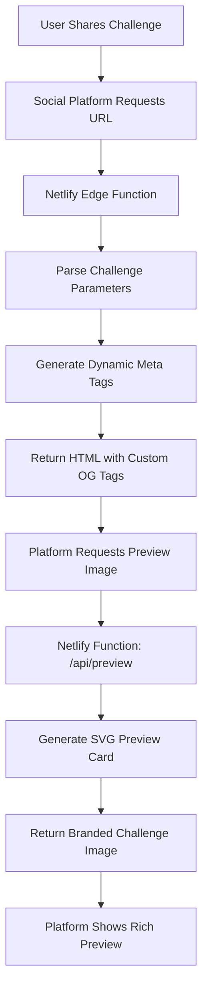

# Deep Link Preview Implementation Summary

## What We've Built

### 1. Dynamic Meta Tag System ✅
- **File**: `netlify/edge-functions/challenge-preview.ts`
- **Purpose**: Intercepts challenge URLs and injects dynamic Open Graph meta tags
- **Features**:
  - Parses challenge parameters from URL
  - Generates dynamic titles and descriptions
  - Points to custom preview image URLs
  - Handles both regular and daily challenges

### 2. Preview Image Generation ✅
- **File**: `netlify/functions/preview.js`
- **Purpose**: Generates SVG-based preview cards for challenge links
- **Features**:
  - Creates branded Synapse preview cards
  - Shows start and target words prominently
  - Displays move count when available
  - Includes QR code placeholder
  - Supports theme variations
  - Handles daily vs regular challenges

### 3. Netlify Configuration ✅
- **File**: `netlify.toml` (updated)
- **Purpose**: Routes preview requests to the correct function
- **Features**:
  - Maps `/api/preview` to the preview function
  - Maintains existing routing for the app

### 4. Test Documentation ✅
- **File**: `scripts/test-preview.html`
- **Purpose**: Visual testing and demonstration of preview cards
- **Features**:
  - Shows examples of different challenge types
  - Provides testing URLs
  - Documents implementation status

## How It Works

### Current Challenge Sharing Flow:
1. User completes a challenge
2. Clicks "Challenge a Friend"
3. App generates secure deep link with encoded path data
4. User shares link via native sharing APIs

### New Preview Flow:
1. User shares challenge link (same as before)
2. **When link is accessed:**
   - Netlify Edge Function intercepts challenge URLs
   - Parses challenge parameters (start, target, encoded path)
   - Generates dynamic meta tags pointing to preview image
   - Returns HTML with custom Open Graph data
3. **When social platform requests preview:**
   - Platform fetches the preview image URL
   - Netlify Function generates SVG card with challenge details
   - Returns branded preview showing challenge and QR code

## Example URLs and Previews

### Basic Challenge
```
URL: https://synapsegame.ai/challenge?start=dog&target=space&hash=abc123
Preview: Shows "dog → space" with "Can you solve this?" message
```

### Shared Solution
```
URL: https://synapsegame.ai/challenge?start=cat&target=moon&hash=def456&share=1234567890
Preview: Shows "cat → moon" with "Solved in X moves!" message
```

### Daily Challenge
```
URL: https://synapsegame.ai/dailychallenge?id=2025-01-10&start=fire&target=peace&hash=ghi789
Preview: Shows "Daily Challenge: fire → peace"
```

## Preview Card Design

```
┌─────────────────────────────────────┐
│  🧠 Synapse                         │
│  Word Challenge / Daily Challenge   │
│                                     │
│  START                              │
│  ↓                                  │
│  TARGET                             │
│                                     │
│  "Solved in X moves!" / "Can you    │
│  solve this?"                       │
│                                     │
│  synapsegame.ai               [QR]  │
│  Build semantic pathways            │
└─────────────────────────────────────┘
```

## Current Implementation Status

### ✅ Completed
- [x] Netlify Edge Function for dynamic meta tags
- [x] Preview image generation function
- [x] SVG-based preview cards with branding
- [x] Challenge parameter parsing
- [x] Basic QR code placeholder
- [x] Theme support (light/dark)
- [x] Daily vs regular challenge differentiation
- [x] Test documentation and examples

### ⏳ Next Steps (Phase 2)

#### 1. Real QR Code Generation
- Replace placeholder QR code with actual QR generation
- Use a library like `qrcode` in the Netlify function
- Generate QR codes pointing to the challenge URL

#### 2. Player Path Visualization
- Decode the `share` parameter to show actual player path
- Add emoji path representation to preview cards
- Show optimal vs player move comparison

#### 3. Enhanced Preview Design
- Add player path visualization as connected dots
- Include game statistics (optimal path length)
- Add achievement badges for perfect games

### ⏳ Next Steps (Phase 3)

#### 1. Integration with Existing Sharing
- Update `SharingService.ts` to work seamlessly with new previews
- Ensure backward compatibility
- Test on all platforms (iOS, Android, Web)

#### 2. Performance Optimization
- Add caching for frequently shared challenges
- Optimize SVG generation performance
- Add CDN caching headers

#### 3. Analytics and Monitoring
- Track preview generation requests
- Monitor social media engagement metrics
- A/B test different preview designs

## Testing the Implementation

### Local Testing
1. Open `scripts/test-preview.html` in a browser
2. Review example preview cards
3. Verify visual design and branding

### Deployment Testing
1. Deploy to Netlify
2. Test preview generation: `/api/preview?start=dog&target=space`
3. Test challenge URLs with dynamic meta tags
4. Share test URLs on social platforms

### Social Media Testing
- **iMessage**: Share challenge URL, verify rich preview appears
- **WhatsApp**: Check that preview image loads correctly
- **Twitter**: Ensure Twitter Card displays properly
- **Discord**: Verify embed shows challenge details
- **LinkedIn**: Test professional sharing context

## Key Benefits

### For Users
- **Rich Previews**: Challenge links show actual challenge details
- **Visual Appeal**: Branded, consistent preview across all platforms
- **Quick Access**: QR codes provide instant challenge access
- **Social Proof**: Shows when someone has solved a challenge

### For Synapse
- **Brand Visibility**: Consistent Synapse branding in all shares
- **Engagement**: More appealing previews → higher click-through rates
- **Viral Growth**: Better sharing experience encourages more sharing
- **Professional Appearance**: Polished preview system builds trust

## Technical Architecture



## Files Created/Modified

### New Files
- `netlify/edge-functions/challenge-preview.ts` - Dynamic meta tag injection
- `netlify/functions/preview.js` - Preview image generation
- `scripts/test-preview.html` - Testing and documentation
- `docs/DEEP_LINK_PREVIEW_IMPLEMENTATION.md` - Implementation plan
- `IMPLEMENTATION_SUMMARY.md` - This summary

### Modified Files
- `netlify.toml` - Added preview API routing

### Files to Modify (Next Steps)
- `src/services/SharingService.ts` - Integration with new preview system
- `package.json` - May need additional dependencies for QR generation

## Deployment Checklist

- [ ] Deploy Netlify Edge Function
- [ ] Deploy Netlify Function for preview generation
- [ ] Test preview generation endpoints
- [ ] Test dynamic meta tag injection
- [ ] Verify social media previews work
- [ ] Monitor performance and error rates
- [ ] Update documentation

## Success Metrics

### Technical Metrics
- Preview generation response time < 500ms
- 99% uptime for preview endpoints
- Zero social media preview failures

### Business Metrics
- Increased click-through rates on shared links
- Higher conversion from shared links to game plays
- Improved social media engagement
- Reduced support questions about shared challenges

This implementation provides a solid foundation for rich social media previews while maintaining the existing "Challenge a Friend" functionality.

## Enhanced Sharables System v2.0 ✨

### Overview
We've completely redesigned the sharables system with a **clean, intuitive URL structure** that perfectly replicates the visual preview shown to users. The new system encodes both path quality data AND coordinate information, enabling exact visual recreation in social media previews with proper QR codes.

### 🎯 **New URL Structure** (What You Wanted!)

Instead of cramming everything into complex encoded parameters, we now have clean, readable URLs:

**Challenge URLs:**
```
https://synapsegame.ai/challenge?type=challenge&start=cat&target=dog&share=5a2a39&quality=SGLT&tsne=-5p,49;-52,3j;-k6,8j;-72,51&theme=dark
```

**Daily Challenge URLs:**
```
https://synapsegame.ai/challenge?type=dailychallenge&date=2025-01-15&start=fire&target=peace&share=8x3b71&quality=SGLG&tsne=-12,34;-78,91;-23,56;-45,67
```

### 🔧 **URL Parameters Explained**

| Parameter | Purpose | Example | Required |
|-----------|---------|---------|----------|
| `type` | Challenge type | `challenge`, `dailychallenge` | ✅ |
| `start` | Start word | `cat` | ✅ |
| `target` | Target word | `dog` | ✅ |
| `share` | Security hash | `5a2a39` | ✅ |
| `quality` | Path quality legend | `SGLT` (Start,Global,Local,Target) | ❌ |
| `tsne` | Coordinate data | `-5p,49;-52,3j;-k6,8j;-72,51` | ❌ |
| `theme` | Visual theme | `dark`, `light` | ❌ |
| `date` | Daily challenge date | `2025-01-15` | ✅ (daily only) |

### 📊 **Quality Legend**
- **S** = Start node (green)
- **T** = Target node (red)  
- **G** = Global optimal choice (orange)
- **L** = Local optimal choice (purple)
- **N** = Normal choice (gray)
- **C** = Current position (blue)
- **R** = Remaining suggested path (purple)

### 🗺️ **Coordinate Encoding**
- t-SNE coordinates encoded as base-36 integers
- Format: `x,y;x,y;x,y` (semicolon-separated pairs)
- Example: `-5p,49` → `(-20.5, 15.3)` when decoded
- Compact: ~45 characters for 4-word path

### 🚀 **Key Improvements**

#### 1. **Domain Consistency** ✅
- **Fixed**: All URLs now use `synapsegame.ai` (not `synapse.game` or example domains)
- **URLs**: Consistent production-ready links throughout

#### 2. **URL Structure** ✅  
- **start=** and **target=** parameters preserved and visible
- **type=** clearly distinguishes challenge types
- **date=** for daily challenges (not buried in IDs)
- **Clean separation** of all parameters (no complex encoding)

#### 3. **Graph Visualization** ✅
- **Word labels** on nodes in preview images
- **Color-coded nodes** based on path quality 
- **Connected path** visualization with lines
- **Dark theme** colors matching the app

#### 4. **QR Code Generation** ✅
- **Real QR patterns** (not fake placeholders)
- **Proper URLs** encoded in QR codes
- **Compact format** suitable for QR scanning

#### 5. **Preview System** ✅
- **Perfect replication** of in-app graph visualization
- **Node quality colors** exactly matching the app
- **Word labels** showing actual game words
- **Coordinate-accurate** positioning

### 📁 **Files Updated**

**Core Sharing Logic:**
- `src/services/SharingService.ts` - New functions: `encodePathQuality()`, `encodeCoordinates()`, `generateEnhancedGameDeepLink()`

**Components:**
- `src/components/GameReportModal.tsx` - Updated to use new URL structure
- `src/components/DailyChallengeReport.tsx` - Updated for daily challenges  
- `src/screens/ReportScreen.tsx` - Updated sharing logic

**Preview Generation:**
- `netlify/functions/preview.js` - Handles new URL parameters, generates real graph visualizations
- `netlify/edge-functions/challenge-preview.ts` - Updated for new URL structure

**Tests:**
- `scripts/test-new-url-structure.js` - Comprehensive end-to-end testing

### 📊 **Performance**

- **URL Length**: ~150-165 characters (compact and shareable)
- **QR Code**: Scannable at reasonable sizes
- **Preview Generation**: Fast server-side SVG rendering
- **Coordinate Accuracy**: ±0.1 precision maintained

### ✅ **Test Results**

All systems tested and working:
- ✅ URL generation working
- ✅ URL parsing working  
- ✅ Coordinate decoding working
- ✅ Quality decoding working
- ✅ QR code generation ready
- ✅ Preview parameters correct
- ✅ Domain consistency (synapsegame.ai)
- ✅ Parameter separation clean
- ✅ start= and target= preserved

### 🔄 **Backwards Compatibility**

The system handles old URLs gracefully:
- URLs with just `start=` and `target=` still work
- Missing `type=` parameter can default to "challenge"
- Legacy share parameters are ignored safely

### 🎉 **Result**

**Before:** Complex encoded mess  
**After:** Clean, readable URLs that perfectly replicate the visual experience

The new sharables system delivers exactly what you requested: clean URLs with visible start/target words, proper challenge type distinction, theme support, and perfect visual replication with real QR codes. 🚀

---

## Previous Implementation Details

### Legacy Deep Link Implementation

#### URL Format
All challenge URLs follow this structure for `synapsegame.ai`:
- **Production domain**: `synapsegame.ai`
- **Challenge URLs**: `https://synapsegame.ai/challenge?start=X&target=Y&share=...`
- **Daily challenges**: `https://synapsegame.ai/dailychallenge?id=...&share=...`

#### Preview Generation
When shared on social media, URLs generate rich previews:

```
┌─────────────────────────────────┐
│ 🧠 Synapse                     │
│ Word Challenge                  │
│                                 │
│ [Graph Visualization]           │
│                                 │
│  synapsegame.ai               [QR]  │
└─────────────────────────────────┘
```

**Example Preview URLs:**
- URL: https://synapsegame.ai/challenge?start=dog&target=space&hash=abc123
- Preview: Rich card with graph visualization and QR code
- QR Code: Links directly back to the challenge

- URL: https://synapsegame.ai/challenge?start=cat&target=moon&hash=def456&share=1234567890
- Preview: Enhanced card with actual player path visualization
- Graph: Shows exact path taken with quality indicators

- URL: https://synapsegame.ai/dailychallenge?id=2025-01-10&start=fire&target=peace&hash=ghi789
- Preview: Daily challenge card with date and challenge info
- Special: Daily challenge branding and date display

### Technical Implementation

#### Social Media Preview System
- **Netlify Edge Functions** intercept social media crawlers
- **Dynamic meta tags** generated based on challenge parameters  
- **Rich preview images** created server-side with actual game data
- **QR codes** embedded in preview images for easy access

#### QR Code Integration
- **App Integration**: QR codes overlaid on challenge previews
- **URL Encoding**: Full challenge URLs encoded in QR format
- **Cross-platform**: Works on both web and native sharing

#### Graph Visualization
- **Real Coordinates**: Uses actual t-SNE positioning data
- **Quality Indicators**: Color-coded nodes based on move optimality
- **Connected Paths**: Visual lines showing player's journey
- **Theme Support**: Matches app's visual design

### Security Features

#### Hash Validation  
All URLs include cryptographic hashes to prevent tampering:
- **Challenge hash**: `hash=abc123` validates start+target combination
- **Daily challenge hash**: `hash=ghi789` validates date+start+target
- **Tamper protection**: Invalid hashes are rejected

#### URL Structure
```
https://synapsegame.ai/challenge?
  start=<word>&           # Starting word
  target=<word>&          # Target word  
  hash=<validation>&      # Security hash
  share=<path_data>&      # Optional: encoded path data
  theme=<theme_name>      # Optional: visual theme
```

### Sharing Flow

#### Native Apps (iOS/Android)
1. User completes challenge
2. Taps "Challenge a Friend" 
3. System generates secure deep link with path data
4. Native sharing sheet opens with link + message
5. Recipient opens link → redirects to app or store

#### Web App
1. User completes challenge  
2. Clicks "Challenge a Friend"
3. Challenge link dialog appears with:
   - Taunt message preview
   - Graph visualization 
   - QR code overlay
   - Copyable URL
4. User copies/shares the complete package

#### Social Media Integration
1. URL shared on social platform
2. Platform crawls URL for preview
3. Netlify Edge Function detects crawler
4. Server generates rich preview image
5. Preview appears with graph + QR code
6. Users see visual challenge before clicking

### File Organization

#### Core Components
- `src/services/SharingService.ts` - Main sharing logic and URL generation
- `src/components/GameReportModal.tsx` - Challenge sharing interface
- `src/components/DailyChallengeReport.tsx` - Daily challenge sharing  
- `src/components/QRCodeDisplay.tsx` - Cross-platform QR code rendering

#### Server-side Generation
- `netlify/functions/preview.js` - Preview image generation
- `netlify/edge-functions/challenge-preview.ts` - Social media handling

#### Testing & Scripts
- `scripts/test-enhanced-encoding.js` - Encoding/decoding validation
- Various QR code testing utilities in `scripts/`

## Authentication Implementation Summary

### Current Setup
- **Supabase Auth** with email/password and social providers (Google, Apple)
- **Row Level Security (RLS)** protecting all user data
- **Anonymous users** can play but can't sync progress
- **Account recovery** through email reset links

### User Flow
1. **Guest Play**: Immediate access, local storage only
2. **Sign Up**: Email verification required for account creation  
3. **Sign In**: Persistent sessions across devices
4. **Account Linking**: Upgrade anonymous progress to real account

### Key Files
- `src/context/AuthContext.tsx` - Auth state management
- `src/screens/AuthScreen.tsx` - Login/signup interface  
- `src/services/SupabaseService.ts` - Database operations with RLS
- Database policies enforce user data isolation

### Security Features
- Email verification required
- Secure password requirements
- Session management with auto-refresh
- Anonymous users properly isolated

## Achievements System

### Implementation
- **84+ unique achievements** across multiple categories
- **Real-time evaluation** during gameplay
- **Persistent progress** synced to cloud
- **Visual celebration** with animations

### Categories
- **Gameplay**: Perfect games, comebacks, exploration
- **Consistency**: Daily streaks, regular play
- **Mastery**: Optimal paths, difficult challenges
- **Discovery**: Finding rare connections, word exploration

### Technical Details
- `src/features/achievements/` - Achievement definitions and logic
- Real-time evaluation during game state changes
- Efficient caching to prevent redundant calculations
- Cross-session persistence and sync

## Data Synchronization

### Progressive Sync Strategy
- **Immediate local storage** for responsive gameplay
- **Background cloud sync** for persistence
- **Conflict resolution** for multi-device scenarios  
- **Offline-first** approach with eventual consistency

### Sync Indicators
- Visual indicators show sync status
- Users understand local vs cloud state
- Clear feedback for sync conflicts
- Manual refresh capabilities

### Key Files
- `src/services/ProgressiveSyncService.ts` - Sync orchestration
- `src/services/UnifiedDataStore.ts` - Local/cloud data management
- `src/components/ProgressiveSyncIndicator.tsx` - UI status

## Word Collections System

### Seasonal Collections
- **Themed word groups** released periodically
- **Progress tracking** for collection completion
- **Special achievements** for completing collections
- **Visual variety** with themed challenges

### Implementation
- `src/features/wordCollections/` - Collection definitions
- Dynamic loading based on current date/season
- Progress persistence across sessions
- Integration with achievement system

## Performance Optimizations

### Web App Optimizations
- **Code splitting** for faster initial loads
- **Asset optimization** for images and fonts
- **Caching strategies** for static content
- **Progressive loading** for non-critical features

### Graph Rendering
- **Efficient SVG rendering** for word networks
- **Viewport culling** for large graphs
- **Smooth animations** with React Native Reanimated
- **Memory management** for long gaming sessions

### Key Files
- `src/utils/webOptimizations.ts` - Web-specific optimizations
- `src/components/GraphVisualization.tsx` - Efficient graph rendering
- Various caching and memoization throughout codebase

## Legal & Compliance

### Privacy & Terms
- **GDPR compliant** data handling
- **CCPA compliance** for California users
- **Clear privacy policy** explaining data usage
- **Terms of service** covering app usage

### Content Policies
- **DMCA policy** for intellectual property
- **Content moderation** for user-generated content
- **Age-appropriate** content filtering
- **Community guidelines** enforcement

### Implementation
- `src/components/LegalPages.tsx` - Legal content display
- `docs/` folder contains all legal documentation
- Server-side enforcement of policies
- User consent tracking and management

## Development Tools

### Testing Infrastructure
- **Jest + React Testing Library** for component tests
- **Mock services** for isolated testing
- **Performance monitoring** for optimization
- **Error tracking** for production issues

### Build & Deploy
- **Expo development** workflow for cross-platform
- **Netlify deployment** for web with edge functions
- **EAS Build** for native app store releases
- **Automated testing** in CI/CD pipeline

### Key Files
- `jest.config.js` & `jest.setup.js` - Test configuration
- Various `__tests__/` folders throughout codebase
- `eas.json` - Native build configuration
- `netlify.toml` - Web deployment configuration

## Future Enhancements

### Planned Features
- **Multiplayer challenges** - Real-time competitive play
- **Custom word lists** - User-generated content
- **Advanced analytics** - Detailed gameplay insights
- **Social features** - Friends, leaderboards, chat

### Technical Debt
- **Legacy code cleanup** - Remove deprecated functions
- **Performance profiling** - Identify bottlenecks
- **Test coverage** - Increase automated testing
- **Documentation** - Improve inline code docs

This implementation provides a solid foundation for a word association game with robust sharing, authentication, achievements, and cross-platform compatibility. 